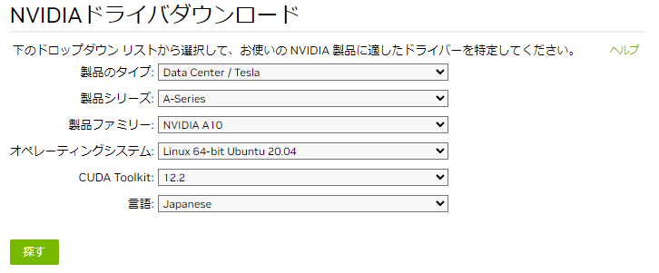

# AWS G5 インスタンス(A10G) のセットアップ方法

## AWS Instance
利用するAWSのインスタンスは`g5.xlarge`を利用する

* [G5 インスタンス](https://aws.amazon.com/jp/ec2/instance-types/g5/)  
G5インスタンスはnvidiaの A10G(24GBPU) GPUを具備したインスタンスを利用することにする。

* 利用インスタンス  

  | 利用インスタンス名 | GPU | vCPU | MEM | Disk[GB] |
  | :---- | :---- | :---- | :---- | :---- |
  | g5.xlarge | A10G (24GB) x 1 | 4 | 16 | 512 |

* local 環境  
  local 環境のOSは以下とする
  * Ubuntu 20.04.6 LTS 

## localhostの環境整備
ローカルホストの環境を整備していく。
事前に`ユーザの作成`、`ユーザにsudoの付与`のみ実施しておく必要がある。

* 初期必要なものをインストール

  ```bash
  # ホスト名を変更しておく（オペミス防止）
  $ sudo hostnamectl set-hostname --static A10-test
  
  # パッケージの更新
  $ sudo apt update
  $ sudo apt dist-upgrade
  $ sudo apt autoremove
  
  # emacs のインストール(重要)
  $ sudo apt-get install emacs -y
  
  # その他のOSS
  $ sudo apt-get install -y --no-install-recommends \
      gcc \
      build-essential \
      patch \
      file \
      git \
      curl \
      swig \
      nkf \
      libmecab-dev \
      locales \
      wget \
      vim \
      emacs \
      unzip \
      mlocate \
      time
  $ sudo apt-get install --reinstall -y libnss3
  $ sudo apt-get install -y language-pack-ja-base language-pack-ja
  $ sudo locale-gen ja_JP.UTF-8
  $ export echo "LANG=ja_JP.UTF-8" >> ~/.bashrc
  $ export echo "LC_ALL=ja_JP.UTF-8" >> ~/.bashrc
  $ export echo "PYTHONIOENCODING=utf-8" >> ~/.bashrc
  $ sudo apt-get install -y python3
  $ sudo apt-get install -y python3-pip
  $ sudo reboot
  ```

* dockerのインストール

  ```bash
  $ sudo apt-get update
  $ sudo apt-get install -y apt-transport-https software-properties-common ca-certificates curl
  $ wget https://download.docker.com/linux/ubuntu/gpg 
  $ sudo apt-key add gpg
  $ echo "deb [arch=amd64] https://download.docker.com/linux/ubuntu $(lsb_release -cs) stable" | sudo tee -a /etc/apt/sources.list.d/docker.list
  $ sudo apt-get update
  $ sudo apt-cache policy docker-ce
  $ sudo apt-get -y install docker-ce
  $ sudo systemctl start docker.service
  $ sudo systemctl enable docker.service
  ```
  
* nvidia driverのインストール  
driverのインストールはnvidiaのwebサイトで選択してドライバをダウンロードする。
URL: https://www.nvidia.co.jp/Download/index.aspx?lang=jp  
選択肢は以下とする
  * 背品タイプ: DataCenter / Tesla
  * 製品シリーズ: A-Series
  * 製品ファミリー: NVIDIA A10
  * オペレーティングシステム: Linux 64-bit Ubuntu 20.04
  * CUDA Toolkit: 12.2 ※一旦最新にしておく
  * 言語: Japanise

<p align="center">

</p>

上記で検索して進めていくとドライバがダウンロードできる。ドライバの名称は時期によって違うと思うが今回ダウンロードしたものは

* nvidia-driver-local-repo-ubuntu2004-535.129.03_1.0-1_amd64.deb

  ```bash
  $ sudo dpkg -i nvidia-driver-local-repo-ubuntu2004-535.129.03_1.0-1_amd64.deb
  (Reading database ... 147476 files and directories currently installed.)
  Preparing to unpack nvidia-driver-local-repo-ubuntu2004-535.129.03_1.0-1_amd64.deb ...
  Unpacking nvidia-driver-local-repo-ubuntu2004-535.129.03 (1.0-1) over (1.0-1) ...
  Setting up nvidia-driver-local-repo-ubuntu2004-535.129.03 (1.0-1) ...
  
  The public nvidia-driver-local-repo-ubuntu2004-535.129.03 GPG key does not appear to be installed.
  To install the key, run this command:
  sudo cp /var/nvidia-driver-local-repo-ubuntu2004-535.129.03/nvidia-driver-local-DD4780A0-keyring.gpg /usr/share/keyrings/
  
  # ※上記のようにコマンドを実行
  $ sudo cp /var/nvidia-driver-local-repo-ubuntu2004-535.129.03/nvidia-driver-local-DD4780A0-keyring.gpg /usr/share/keyrings/
  $ sudo apt-get update
  $ sudo apt-get install cuda-drivers
  $ sudo reboot
  ```
  ```bash
  # 再起動後に`nvidia-smi`が使えたらOK
  nvidia-smi -l 1
  Mon Dec 18 14:23:35 2023
  +---------------------------------------------------------------------------------------+
  | NVIDIA-SMI 535.129.03             Driver Version: 535.129.03   CUDA Version: 12.2     |
  |-----------------------------------------+----------------------+----------------------+
  | GPU  Name                 Persistence-M | Bus-Id        Disp.A | Volatile Uncorr. ECC |
  | Fan  Temp   Perf          Pwr:Usage/Cap |         Memory-Usage | GPU-Util  Compute M. |
  |                                         |                      |               MIG M. |
  |=========================================+======================+======================|
  |   0  NVIDIA A10G                    On  | 00000000:00:1E.0 Off |                    0 |
  |  0%   25C    P8              10W / 300W |      4MiB / 23028MiB |      0%      Default |
  |                                         |                      |                  N/A |
  +-----------------------------------------+----------------------+----------------------+
  
  +---------------------------------------------------------------------------------------+
  | Processes:                                                                            |
  |  GPU   GI   CI        PID   Type   Process name                            GPU Memory |
  |        ID   ID                                                             Usage      |
  |=======================================================================================|
  |  No running processes found                                                           |
  +---------------------------------------------------------------------------------------+
  ```

* NVIDIA Container Toolkit  
dockerでgpuをつかめるようにする
  ```bash
  $ distribution=$(. /etc/os-release;echo $ID$VERSION_ID)
  $ curl -s -L https://nvidia.github.io/nvidia-docker/gpgkey | sudo apt-key add -
  $ curl -s -L https://nvidia.github.io/nvidia-docker/$distribution/nvidia-docker.list | sudo tee /etc/apt/sources.list.d/nvidia-docker.list
  $ sudo apt-get update && sudo apt-get install -y nvidia-container-toolkit
  $ sudo systemctl restart docker
  ```
